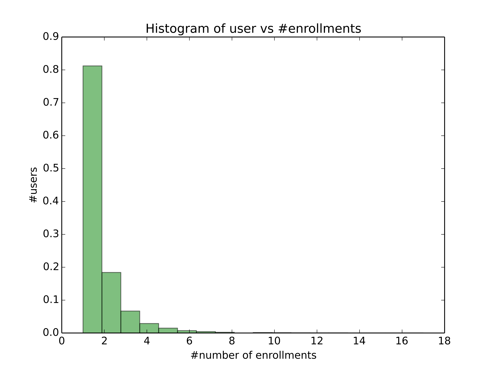
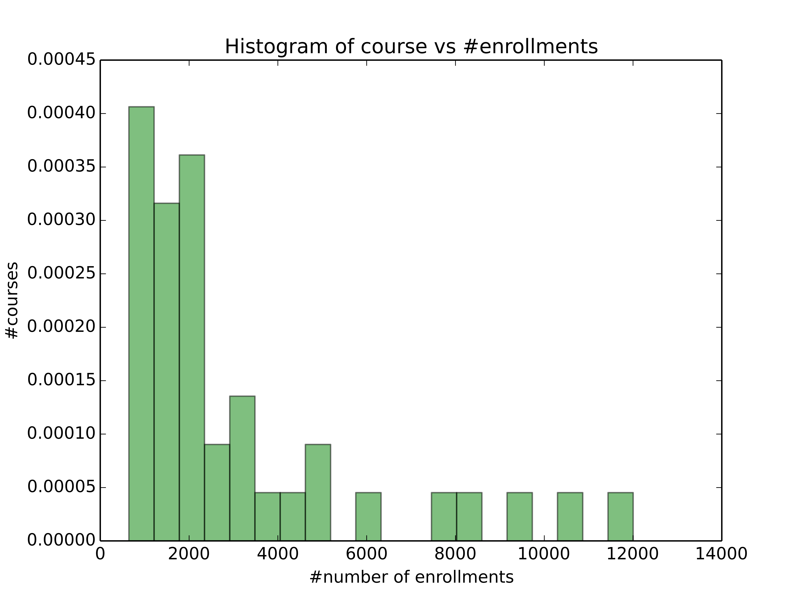

## Screenshot of XuetangX

## Description

The competition participants need to predict whether a user will drop a course within next **10 days** based on his or her prior activities. If a user leaves no records for course C in the log during the next 10 days, we define it as dropout from course.

## Timeline

    - May 1 - May 15: Review Problem and Download Data
    - June 23: Team Merger Deadline
    - June 29: First Submission Deadline
    - July 5: End Date
    - July 10: Winner Announcement

## Data

**Log file:** each line is a user activity record called ‘event’. Each event contains the following information: user ID, course ID, event timestamp, event type, event source (server or browser), object. There are seven types of events:
    - problem – Interaction with the course’s quiz;
    - video - Interaction with the course’s video;
    - access – Interaction with other course objects (rather than videos or quizzes);

    - wiki – Interaction with the course wiki;
    - discussion – Interaction with the course forum.
    - navigate - Navigation through the course;
    - page_close – Leaving the course’s web page.

**Module file**: A module represents a specific resource of the course, e.g., chapter, video, problem set and so on. The modules are organized in a tree: each course consists of several chapters; each chapter consists of several sections; each section consists of several videos/problem sets. Each line in the file contains a module category, IDs of its children modules, its release date etc.

Each line in this file describes a module in a course with its category, children objects and release time. Those modules represent different online materials of the courses, e.g., chapters, videos, problem sets and etc. The modules are organized as a tree, i.e., each course contains several chapters; each chapter contains several sections; and each section contains several objects (videos, problem sets, and etc).

       ·course_id - The course to which the module belongs.
       ·module_id - The ID of a course module.
       ·category - The category of the course module.
       ·children - The children modules of the course module.
       ·start - The time that the module was released to students.

## Data Statistics

### Train

|               | Users      | Courses    | Enrollments| Events     |
|:--------------|:-----------|:-----------|:-----------|:-----------|
|**Statistics** | 79,186     | 39         | 120,542    | 8,157,277  |

### Test

|               | Users      | Courses    | Enrollments| Events     |
|:--------------|:-----------|:-----------|:-----------|:-----------|
|**Statistics** | 58,364     | 39         | 80,362     | 5,387,847  |

    Note: 33,262 new users in the test dataset

### Histogram of #users vs #enrollments

| \#number enrollments | \#number users | \#percentage |
|:--------------------|:--------------|:------------|
| 1                   | 57165         | 72.191%     |
| 2                   | 12958         | 16.364%     |
| 3                   | 4698          | 5.933%      |
| 4                   | 2029          | 2.562%      |
| 5                   | 1048          | 1.323%      |
| 6                   | 511           | 0.645%      |
| 7                   | 309           | 0.390%      |
| 8                   | 159           | 0.201%      |
| 9                   | 99            | 0.125%      |
| 10                  | 66            | 0.083%      |
| 11                  | 38            | 0.048%      |
| 13                  | 26            | 0.033%      |
| 12                  | 23            | 0.029%      |
| 14                  | 19            | 0.024%      |
| 15                  | 13            | 0.016%      |
| 16                  | 9             | 0.011%      |
| >= 17               | 16            | 0.020%      |

### Histogram of #courses vs #enrollments

## Starting point

* [Who is likely to drop out and why?](https://www.edx.org/blog/who-likely-drop-out-why)

* [Likely to stop? Predicting Stopout in Massive Open Online Courses](http://arxiv.org/abs/1408.3382)

* [http://groups.csail.mit.edu/EVO-DesignOpt/groupWebSite/uploads/Site/TaylorStopoutThesis.pdf](http://groups.csail.mit.edu/EVO-DesignOpt/groupWebSite/uploads/Site/TaylorStopoutThesis.pdf)

* [**\[important\]** http://moocdb.csail.mit.edu/index.php](http://moocdb.csail.mit.edu/index.php)

* **Feature engineering**

    1. [Towards Feature Engineering at Scale
for Data from Massive Open Online Courses](http://arxiv.org/abs/1407.5238)
    2. [http://www.cap.ca/sites/cap.ca/files/article/1037/july08-offprint-slavin.pdf](http://www.cap.ca/sites/cap.ca/files/article/1037/july08-offprint-slavin.pdf)

* **Sequence classification**

    1. [“Turn on, Tune in, Drop out”: Anticipating student dropouts in Massive Open Online Courses](http://lytics.stanford.edu/datadriveneducation/papers/yangetal.pdf)
        - analyzed forum posts to predict drop out.
        - 4 different cohorts of students:  learners who participated in forums (discussion generators), learners who edited wikis (content generators), learners who did both (fully collaborative) and learners who did neither (passive collaborators). Students in the "No attempts" cohort never submitted an assignment so, by our definition, are considered to have dropped out in week one.
    2. [Dropout Prediction in MOOCs using Learner Activity Features](http://lytics.stanford.edu/wordpress/wp-content/uploads/2013/07/Last-Version.pdf)

## Methodology

**Evaluation Alternatives**

- 2-class logarithmic loss

$$loglog = -\frac{1}{N} \sum_{i=1}^N \left(y_i \log p_i + (1 - y_i) \log (1 - p_i) \right)$$
where $N$ is the number of instances, $y_i$ is the truth label, and $p_i$ is the predicted probability.

**Notations**

* course $c {\in} C$, where $C$ is the course set
* user $u {\in} U$, where $U$ is the user set
* triple enrollment $e = \{u, c, l\}$, where $l$ is the truth label

### Logistic Regression

### RF

- [http://meroa.com/what-is-Gradient-Boosting-Models-and-Random-Forests-using-layman-terms/][http://meroa.com/what-is-Gradient-Boosting-Models-and-Random-Forests-using-layman-terms/]

### Follow-the-Regularized-Leader

### Latent Factor Model

$p(e_l = 1|e) = 1 /(1 + \exp(-p_{e_c} \sum_{c \in C(e_u)}q_c))$

where $e_l$ is the label of enrollment $e$, and $p_c$ and $q_c$ is the latent factors respectively.

**References**

1. [https://github.com/kimjingu/nonnegfac-python](https://github.com/kimjingu/nonnegfac-python)
2. [https://github.com/coreylynch/pyCLiMF](https://github.com/coreylynch/pyCLiMF)
3. [https://github.com/guyz/pyrecengine](https://github.com/guyz/pyrecengine)

### Libfm

### Features

|       | **Name** | **Definition** |
|:------|:---------|:-----------------------|
| $x_1$ | stopout  |  Whether the student has stopped out or not |
| $x_2$ | total duration|  Total time spent on all resources |
| $x_3$ | number forum posts | Number of forum posts |
| $x_4$ | number wiki edits | Number of wiki edits |
| $x_5$ | observed event variance | Variance of a student’s observed event timestamps |

## Ideas

- Each course has its own predictive model.
- Student cohorts

- Markov transition pattern across different pages [LINK](http://meroa.com/markov-chain-shopping-guide/)

## Calibration [PDF](https://github.com/infinitezxc/kaggle-avazu/blob/master/doc.pdf)

- The observed average dropout ratio $c_a$ and our predicted dropout ratio $c_p$

- We define
$$invert\_logit = \log (\frac{x}{1-x})$$
$$logit(x) = \frac{1}{1 + \exp(-x)}$$

- The calibration is as follows:
$$intercept = invert\_logit(c_p) - invert\_logit(c_a)$$
$$p = logit(invert\_logit(p) - intercept)$$
where $p$ is the predicted result.

## Ensemble

- [http://meroa.com/voting-model-intro/][http://meroa.com/voting-model-intro/]
- [http://meroa.com/heteroscedasticity/][http://meroa.com/heteroscedasticity/]

## Social

1. Random Walker [[blog](http://ghost-infinitezxc.rhcloud.com/)
    | [github](http://github.com/infinitezxc/kaggle-avazu)]

    <!-- * [新词挖掘](http://ghost-infinitezxc.rhcloud.com/new_word_mining_based_on_weibo/) -->
